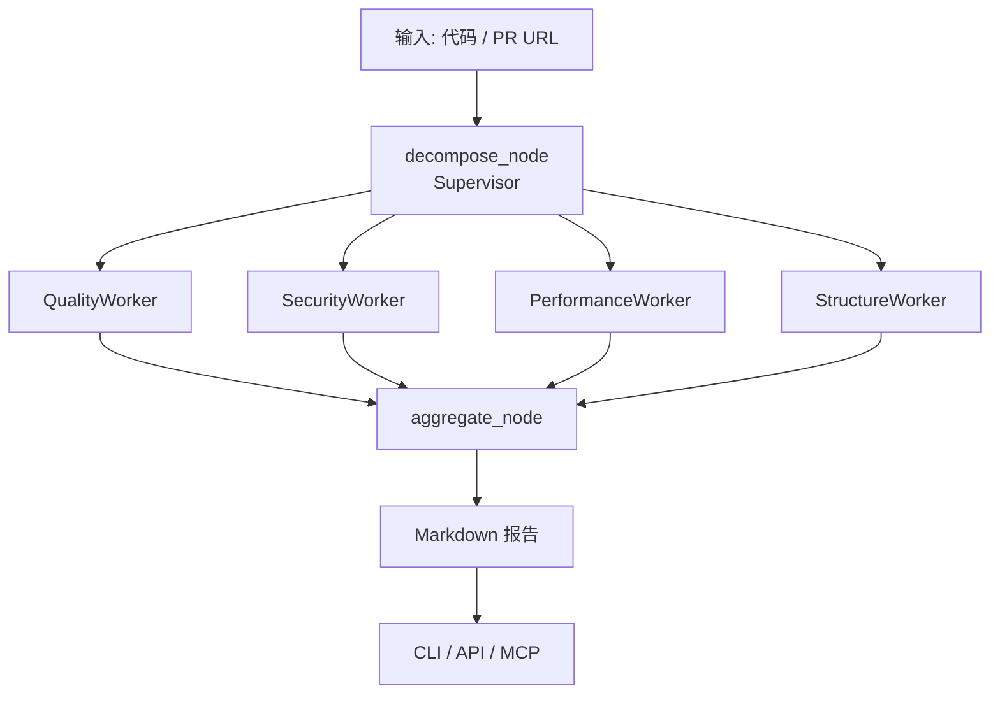

# cr-agent · 多 Agent 代码审查协作平台

[](https://github.com/tianhua/cr-agent/actions/workflows/ci.yml)


**在线演示**: [https://cr-agent-production.up.railway.app](https://cr-agent-production.up.railway.app)（如未部署请使用本地启动）

**cr-agent** 是一个基于 LangGraph Supervisor-Worker 架构的多 Agent 代码审查系统。你提交一段代码（本地文件或 GitHub PR），Supervisor 自动拆解审查任务，4 个专业 Worker Agent **并行**审查，最后聚合出一份结构化 Markdown 报告。

---

## 快速上手

```bash
# 安装依赖
pip install -r backend/requirements.txt

# 审查一个文件
python -m backend.cli review --file samples/sample_bad_python.py

# 审查 GitHub PR
python -m backend.cli review --pr https://github.com/octocat/Hello-World/pull/1

# 启动 API 服务
uvicorn backend.main:app --reload

# 跑全部测试
pytest backend/tests/ -v
```

## 功能特性

- **多 Agent 并行审查**：4 个专业 Worker（质量 / 安全 / 性能 / 架构）同时审查
- **多模型支持**：可为不同角色配置不同 LLM 模型（降本策略）
- **SSE 流式输出**：实时查看每个 Worker 的审查进度
- **GitHub 集成**：支持 PR URL 审查 + Webhook 自动触发
- **JWT 鉴权**：生产环境启用 Bearer token 鉴权
- **Langfuse 追踪**：完整的调用链路和成本分析
- **MCP Gateway**：通过 MCP 协议暴露为外部工具

## 架构



### 核心设计

| 模块 | 职责 | 关键文件 |
|------|------|---------|
| **Supervisor** (`decompose_node`) | 分析代码 → 拆解子任务列表 (LLM → JSON) | `services/supervisor/decompose.py` |
| **Worker × 4** | 并行审查各维度；BaseWorker 模板方法模式 | `services/workers/{quality,security,performance,structure}.py` |
| **Aggregator** | 合并去重 + 排序 → 渲染 Markdown 报告 | `services/aggregator/{merge,report}.py` |
| **API** | `POST /api/v1/reviews` + SSE 流式 + 模型配置 | `api/reviews.py`, `api/models.py` |
| **Auth** | JWT Bearer 鉴权 + API_KEY 换取 token | `api/auth.py` |
| **CLI** | `--file <path>` 或 `--pr <url>` 两入口 | `cli/main.py` |
| **MCP Gateway** | FastMCP Server（5 个 Tool + 2 个 Resource） | `mcp/server.py` |
| **GitHub 集成** | `.patch` 拉取 + Webhook 验签 | `integrations/github.py` |

## 技术栈

| 层 | 技术 |
|----|------|
| 编排框架 | LangGraph (StateGraph + fan-out/fan-in + 条件路由) |
| Agent 基类 | 模板方法模式 + `__init_subclass__` 编译期校验 |
| 后端 | FastAPI async + SQLAlchemy async |
| 数据库 | SQLite (dev) / PostgreSQL (prod) + asyncpg |
| LLM | OpenAI 兼容 API（6 个角色可独立配置模型） |
| MCP | FastMCP + Streamable HTTP |
| 鉴权 | JWT (HS256) + Bearer token |
| 追踪 | Langfuse（调用链 + Token 成本） |
| 测试 | pytest + pytest-asyncio (226 tests, 91% coverage) |
| 部署 | Docker + Railway |

## 多模型配置

可为 6 个角色配置不同模型（实现降本策略）：

```bash
# .env
CR_AGENT_DECOMPOSE_MODEL=gpt-4o-mini      # 任务拆解：便宜模型
CR_AGENT_WORKER_QUALITY_MODEL=gpt-4o      # Worker：强模型
CR_AGENT_WORKER_SECURITY_MODEL=gpt-4o
CR_AGENT_WORKER_PERFORMANCE_MODEL=gpt-4o
CR_AGENT_WORKER_STRUCTURE_MODEL=gpt-4o
CR_AGENT_JUDGE_MODEL=gpt-4o               # 综合判断：最强模型
```

前端 Playground 提供可折叠的模型选择面板，支持 per-request 覆盖。

## 评测结果

在 26 条人工标注样本上，LLM-as-Judge 三维度评分 + 硬指标 PRF 双轨评估：

| 分类 | composite | recall (PRF) |
|------|-----------|-------------|
| **安全审查** | 0.97 | 0.82 |
| **代码质量** | 0.90 | 0.75 |
| **性能** | 0.85 | 0.74 |
| **架构** | 0.75 | 0.67 |
| **综合** | **0.87** | **0.77** |

> recall 0.77（漏报少）但 precision 0.08（过报多）→ 下一步加置信度阈值过滤。

## 部署

### Railway（推荐）

```bash
# 1. 安装 CLI
npm install -g @railway/cli

# 2. 登录并初始化
railway login
railway init

# 3. 设置环境变量（Dashboard → Variables）
# CR_AGENT_CHAT_API_KEY, CR_AGENT_CHAT_BASE_URL, CR_AGENT_JWT_SECRET, etc.

# 4. 添加 PostgreSQL 数据库
# Dashboard → New → Database → Add PostgreSQL

# 5. 部署
railway up
```

详细部署指南：[docs/deployment.md](docs/deployment.md)

### Docker 本地

```bash
docker build -t cr-agent .
docker run -p 8000:8000 \
  -e CR_AGENT_CHAT_API_KEY=sk-xxx \
  -e CR_AGENT_CHAT_BASE_URL=https://api.openai.com/v1 \
  cr-agent
```

## 容错设计

- **LLM JSON 解析失败** → 降级为默认拆解 / info 级 finding
- **Worker 超时** (asyncio.wait_for 120s) → 返回降级标记，不阻塞
- **Worker 异常** → 捕获记录 error，其他 Worker 不受影响
- **死循环熔断** (max_iterations=3) → 直达 aggregate
- **空代码** → 直接返回 error，不调 LLM
- **DB 连接失败** → health 端点返回 degraded，不直接崩溃

## 设计决策

1. **自研 Supervisor-Worker → 不用 CrewAI**：每个节点自己能讲清，面试不甩锅给框架
2. **LangGraph fan-out/fan-in**：原生并行 + `operator.add` reducer 无竞态
3. **BaseWorker 模板方法**：4 个子类只设 system_prompt，核心流程复用
4. **多模型支持**：6 个角色独立配置，实现降本策略
5. **JWT 鉴权**：开发态关闭，生产态开启，fail-open 策略
6. **MCP Gateway**：统一入口，外部客户端不关心内部图结构
7. **软硬双指标评测**：LLM-as-Judge + PRF（确定性可复现）

## 为什么做这个项目

这个项目是我的第二个秋招项目。第一个项目 [ai-resume-analyzer](https://github.com/tianhua/ai-resume-analyzer) 做了 RAG 全链路 + Agentic RAG + MCP，底层扎实但缺 **多 Agent 编排 / Agent 评测**。cr-agent 用实战补齐这些 R0 知识点：

- **多 Agent 编排**：LangGraph 状态图 + 并行分发 + 条件路由
- **Agent 容错**：超时 / 异常 / 熔断 / 降级
- **Agent 评测**：LLM-as-Judge + 硬指标 PRF + Token 成本计量
- **成本控制**：多模型配置（降本）+ TokenMeter 拦截计量
- **生产部署**：Docker + Railway + PostgreSQL + JWT 鉴权

## License

MIT
